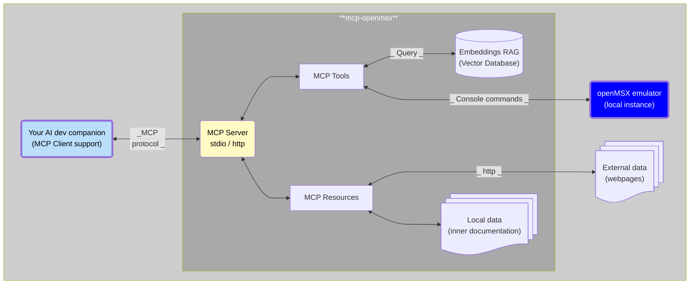

# MCP-openMSX

_"Orchestrating a binary opera where AI conducts, MCP interprets, and openMSX acts as the 8-bit diva."_

[](https://github.com/nataliapc)
[](https://github.com/nataliapc/mcp-openmsx/blob/main/LICENSE)
[
](https://github.com/nataliapc/mcp-openmsx/stargazers/)  
[](https://www.npmjs.com/package/@nataliapc/mcp-openmsx?activeTab=versions)
[]()

A [Model Context Protocol](https://modelcontextprotocol.io/introduction) (MCP) server for automating [openMSX emulator](https://github.com/openMSX/openMSX) instances.

This server provides comprehensive tools for MSX software development, testing, and automation through standardized MCP protocols.


> 🎁🎁 _If you find this project useful, please consider making a donation by [PAYPAL Link](https://www.paypal.com/donate/?hosted_button_id=9X268YDDS9SYC) or [GitHub Sponsors](https://github.com/sponsors/nataliapc)_

---

## Table of Contents

- [Project overview](#project-overview)
- [Architecture](#architecture)
- [Available MCP Tools](#available-mcp-tools)
- [Available MCP Resources](#available-mcp-resources)
- ⚡ [Quick Start](#quick-start)
  - [Quick installation with **VSCode**](#quick-installation-with-vscode)
  - [Basic installation with **Claude Desktop**](#basic-installation-with-claude-desktop)
  - [Environment Variables](#environment-variables)
- [Advanced manual usage](#advanced-manual-usage)
- [Development](#development)
- [License](#license)
- [Support](#support)
- [Contributing](#contributing)
- 🌟 [More stars!](#more-stars) 🌟

## Project Overview

This project creates a bridge between modern AI-assisted development (e.g. GitHub Copilot, Claude Desktop) and retro computing (MSX systems) by providing:

- **Emulator Control**: Launch, configure, manage openMSX instances, and replay timelines.
- **Media Management**: Handle ROM cartridges, floppy disks, and cassette tapes.
- **BASIC Programming Support**: Tools to facilitate BASIC language programming and development.
- **Debugging Tools**: Full CPU debugging with breakpoints, memory inspection, and step execution.
- **Video Control**: VDP register manipulation and screen capture.
- **Memory Operations**: Read/write RAM, VRAM, and I/O port access.
- **Automation**: Keyboard input simulation and savestate management.
- **Hybrid Documentation Search**: Query an embedded local index of MSX resources combining semantic (multilingual embeddings) and keyword (BM25) search, runs fully offline.
- **Hybrid Mode**: This MCP server supports hybrid access mode (_STDIO_ and _HTTP_ transports).

## Architecture



The MCP server translates high-level natural language commands from your Copilot AI into `TCL` commands to control `openMSX`, enabling automated MSX software testing and debugging.

## Available MCP Tools

### Emulator Control Tools
- `emu_control`: Controls an openMSX emulator: _`launch`, `close`, `powerOn`, `powerOff`, `reset`, `getEmulatorSpeed`, `setEmulatorSpeed`, `machineList`, `extensionList`, `wait`_.
- `emu_replay`: Controls emulation timeline: _`start`, `stop`, `status`, `goBack`, `absoluteGoto`, `advanceFrame`, `reverseFrame`, `truncate`, `saveReplay`, `loadReplay`_.
- `emu_info`: Obtain informacion about the current emulated machine: _`getStatus`, `getSlotsMap`, `getIOPortsMap`_.
- `emu_media`: Manage ROM, disk, and tape media: _`tapeInsert`, `tapeRewind`, `tapeEject`, `romInsert`, `romEject`, `diskInsert`, `diskInsertFolder`, `diskEject`_.
- `emu_vdp`: Manage VDP (Video Display Processor): _`getPalette`, `getRegisters`, `getRegisterValue`, `setRegisterValue`, `screenGetMode`, `screenGetFullText`_.

### Programming Tools
- `basic_programming`: BASIC tools: _`isBasicAvailable`, `newProgram`, `runProgram`, `setProgram`, `getFullProgram`, `getFullProgramAdvanced`, `listProgramLines`, `deleteProgramLines`_.

### Debugging Tools
- `debug_run`: Control execution: _`break`, `isBreaked`, `continue`, `stepIn`, `stepOut`, `stepOver`, `stepBack`, `runTo`_.
- `debug_cpu`: Read/write CPU registers, CPU info, Stack pile, and Disassemble code: _`getCpuRegisters`, `getRegister`, `setRegister`, `getStackPile`, `disassemble`, `getActiveCpu`_.
- `debug_memory`: RAM memory operations: _`selectedSlots`, `getBlock`, `readByte`, `readWord`, `writeByte`, `writeWord`, `writeBlock`, `searchBytes`_.
- `debug_vram`: VRAM operations: _`getBlock`, `readByte`, `writeByte`, `searchBytes`_.
- `debug_breakpoints`: Breakpoint management: _`create`, `remove`, `list`_.
- `debug_log`: Debug log: _`log`, `read`_.
- `debug_conditions`: Condition management (like breakpoints, but not tied to an address — a Tcl expression evaluated continuously while the CPU runs): _`create`, `remove`, `list`_.

### Automation Tools
- `emu_keyboard`: Send text or key combinations to emulator: _`sendText`, `sendKeyCombo`_.
- `emu_savestates`: Save and restore machine states: _`load`, `save`, `list`_.
- `screen_shot`: Capture emulator screen: _`as_image`, `to_file`_.
- `screen_dump`: Export screen data as BASIC BSAVE instruction.
- `msxdocs_resource_get`: Retrieve MCP resources for MCP clients that don't support MCP resources.

### Documentation Tools
- `vector_db_query`: Hybrid search (semantic embeddings + BM25) over the local MSX documentation index, for information about MSX systems, cartridges, programming, and other development resources.
- `msxdocs_resource_get`: Retrieve MCP resources for MCP clients that don't support MCP resources.

### Optional Advanced Tools
- `openmsx_tcl_cmd`: Executes a native Tcl command in the connected openMSX instance. It is disabled by default and is registered only when the user sets `OPENMSX_ENABLE_RAW_TCL=true`. Existing typed tools remain available and are preferred for operations they cover.

## Available MCP Resources

### What are MCP Resources?

MCP resources are structured data sets, documentation, and helper files that extend the capabilities of the MCP server. They provide essential information such as machine definitions, extension lists, media templates, and programming examples, enabling more powerful automation, testing, and development workflows for MSX software within the MCP-openMSX environment.

### Available Resources

There are more than 60 resources available, some included directly in the MCP and others accessible via download when queried. They are organized into the following categories:

- `Processors` (Z80, R800)
- `Bios` (Bios ROM, DOS ROM, SUBROM, ...)
- `System`
- `Audio`
- `Video`
- `Programming` (ASM, BASIC, ...)
- `MSX-DOS`
- `MSX-UNAPI`
- `MSX BASIC`

And books and manuals:

- `MSX2 Technical Handbook`
- `The MSX Red Book`
- `SDCC Compiler`

### Resources from:

- [Grauw MSX Assembly Page](https://map.grauw.nl/)
- [Z80 Heaven Wiki](http://z80-heaven.wikidot.com/)
- [The MSX Red Book](https://github.com/gseidler/The-MSX-Red-Book)
- [MSX2 Technical Handbook](https://github.com/Konamiman/MSX2-Technical-Handbook)
- [Konamiman MSX-UNAPI-specification](https://github.com/Konamiman/MSX-UNAPI-specification)
- [BiFi MSX Net](http://bifi.msxnet.org/msxnet/)
- [MRC Wiki](https://www.msx.org/wiki/Main_Page)
- [MSX Banzai!](http://msxbanzai.tni.nl/)
- [SDCC](https://sdcc.sourceforge.net/)

Thanks to the authors of these resources, who have made them available under various licenses. This MCP server includes some of these resources to enhance the development experience.

> [!IMPORTANT]  
> The rights to these resources belong to their respective authors and are distributed under the licenses they have defined.

## Quick Start

You can use this MCP server in this basic way with the [precompiled NPM package](https://www.npmjs.com/package/@nataliapc/mcp-openmsx).

### Quick installation with VSCode

[](https://insiders.vscode.dev/redirect/mcp/install?name=mcp-openmsx&config=%7B%22name%22%3A%22mcp-openmsx%22%2C%22type%22%3A%22stdio%22%2C%22command%22%3A%22npx%22%2C%22args%22%3A%5B%22-y%22%2C%22%40nataliapc%2Fmcp-openmsx%22%5D%7D)

Steps to install the MCP server in VSCode:
1. Install [Github Copilot extension](https://code.visualstudio.com/docs/copilot/overview)
2. [Install nodejs](https://nodejs.org/en/download) (`npx` command must be available in your PATH).
3. Install de MCP Server:
    - Use the **Install MCP Server** button above to install the MCP server in your VSCode settings.
    - Or add to your _workspace folder_ a file named `.vscode/mcp.json` with the json configuration below.

### STDIO mode (recommended)

```json
{
  "servers": {
    "mcp-openmsx": {
      "command": "npx",
      "args": ["@nataliapc/mcp-openmsx"],
      "env": {
        "OPENMSX_SHARE_DIR": "C:\\the\\location\\of\\your\\openmsx\\share\\folder"
      }
    }
  }
}
```

> [!NOTE]  
> In Windows you can change the `command` field to `npx.cmd` if you experience permission issues.

> [!NOTE]  
> Environment variables are optional. Customize them as you need.

### Streamed HTTP mode (more advanced)

```json
{
  "servers": {
    "mcp-openmsx": {
      "type": "http",
      "url": "http://localhost:3000/mcp",
      "headers": { }
    }
  }
}
```

> [!NOTE]  
> The MCP HTTP Server must be running standalone in the same computer or in another (`make run_http`).

### Basic Installation with Claude Desktop

Follow [these instrutions](https://modelcontextprotocol.io/quickstart/user#for-claude-desktop-users) to access Claude's `claude_desktop_config.json` file.

Edit it to include the following JSON entry:

```json
{
  "mcpServers": {
    "mcp-openmsx": {
      "command": "npx",
      "args": ["@nataliapc/mcp-openmsx"],
      "env": {
        "OPENMSX_SHARE_DIR": "C:\\the\\location\\of\\your\\openmsx\\share\\folder"
      }
    }
  }
}
```

> [!NOTE]  
> Environment variables are optional. Customize them as you need.

### Environment Variables

| Variable | Description | Default Value | Example |
|----------|-------------|---------------|---------|
| `OPENMSX_EXECUTABLE` | Path or command to the openMSX executable | Auto-detected: `openmsx` (Linux), `/Applications/openMSX.app/Contents/MacOS/openmsx` (macOS), `openmsx.exe` (Windows) | `/usr/local/bin/openmsx` or `C:\Program Files\openMSX\openmsx.exe` |
| `OPENMSX_SHARE_DIR` | Directory containing openMSX data files (machines, extensions, etc.) | System dependent | `/home/myuser/.openmsx/share` |
| `OPENMSX_SCREENSHOT_DIR` | Directory where screenshots will be saved | Default for openmsx | `/myproject/screenshots` |
| `OPENMSX_SCREENDUMP_DIR` | Directory where screen dumps will be saved | Default for openmsx | `/myproject/screendumps` |
| `OPENMSX_REPLAYS_DIR` | Directory where replay files will be saved | Default for openmsx | `/myproject/replays` |
| `OPENMSX_ENABLE_RAW_TCL` | Register the optional `openmsx_tcl_cmd` native Tcl tool. This grants the MCP client powerful access to openMSX and potentially the host filesystem; enable it only when explicitly required. | `false` | `true` |
| `OPENMSX_LAUNCH_HEADLESS` | Launch openMSX without a renderer window (headless mode). Sets `renderer` to `none` instead of the default `SDLGL-PP` at startup. Useful for CI, testing, and server-side environments. | `false` | `true` |
| `MCP_TRANSPORT` | Transport mode (`stdio` or `http`) | `stdio` | `http` |
| `MCP_HTTP_PORT` | Port number for HTTP transport mode | `3000` | `8080` |
| `MCP_ALLOWED_ORIGINS` | Comma-separated list of allowed origins for HTTP transport | Empty for all allowed | `http://localhost,http://mydomain.com` |
| `OPENMSX_WINDOWS_CONTROL` | **Windows only.** How the server talks to openMSX's control socket (see below) | `stdio-proxy` | `direct-sspi` |
| `OPENMSX_WINDOWS_PROXY_EXECUTABLE` | **Windows only.** Override path to the SSPI proxy helper (development) | Bundled `bin/win-x64/mcp-openmsx-sspi-proxy.exe` | `C:\path\to\mcp-openmsx-sspi-proxy.exe` |
| `OPENMSX_MODELS_CACHE` | Directory where the embedding model is cached (also honors `HF_HOME` / `TRANSFORMERS_CACHE`) | `~/.cache/mcp-openmsx` | `/opt/models` |
| `OPENMSX_EMBED_PROVIDER` | **Index generator only.** `cuda` uses the GPU (fp32 model) to regenerate the index, falling back to CPU if CUDA is unavailable. The MCP server itself always uses CPU/int8 and ignores this variable. | (generator: `cpu`) | `cuda` |

#### Native Tcl command tool (`OPENMSX_ENABLE_RAW_TCL`)

The optional `openmsx_tcl_cmd` tool provides direct access to openMSX's native Tcl console for advanced or version-specific functionality not covered by the typed tools. It can use the runtime self-documentation commands `help`, `about`, `openmsx_info`, and `machine_info` before executing unfamiliar commands.

The tool is not registered by default. Only the user should enable it in the MCP server configuration:

```json
{
  "env": {
    "OPENMSX_ENABLE_RAW_TCL": "true"
  }
}
```

Direct Tcl is intentionally unrestricted and may modify emulator state, access files, load scripts, or terminate openMSX. Treat it as equivalent to granting the MCP client local command execution privileges. Restart the MCP server after changing the setting.

#### Documentation search model

The `vector_db_query` tool runs a local hybrid search (semantic embeddings + BM25). The embedding model
(`multilingual-e5-small`, ONNX quantized, ~118 MB, 512-token context, multilingual) is **downloaded once**
from the HuggingFace Hub on the first query and cached on disk (see `OPENMSX_MODELS_CACHE` above). After that
it runs fully offline. No API key is required. To pre-populate the cache for air-gapped environments, run one
query on a networked machine and copy the cache directory.

Regenerating the index (rare) embeds the whole corpus. On CPU this is slow; on an NVIDIA GPU set
`OPENMSX_EMBED_PROVIDER=cuda` for the generator to use it (requires CUDA 13 runtime libraries + cuDNN 9),
which is ~50× faster. The GPU path uses the larger fp32 model; the server keeps using the int8 model and
the two are interchangeable for search (same ranking). End users never download the fp32 model.

#### Windows control modes (`OPENMSX_WINDOWS_CONTROL`)

On Windows, openMSX is a GUI app whose TCP control socket requires SSPI (Negotiate/NTLM) authentication. The server supports several transports:

| Value | Description |
|-------|-------------|
| `stdio-proxy` | **Default.** Launches a self-contained .NET helper that performs SSPI and exposes a clean XML stdio channel — the most robust path. |
| `direct-sspi` | Authenticates from Node via the optional `node-expose-sspi` package. Fallback / debugging. |
| `socket` | Legacy alias of `direct-sspi`. |

Linux and macOS are unaffected (`openmsx -control stdio`).

The bundled proxy is built from `helpers/openmsx-sspi-proxy` and can be rebuilt reproducibly from Linux with Docker (no local .NET required):

```bash
cd mcp-server
pnpm build:proxy:win-x64:docker   # → bin/win-x64/mcp-openmsx-sspi-proxy.exe
```


## Advanced Manual Usage

> [!IMPORTANT]  
> This is not needed for using the MCP server, but if you want to install it manually, follow these steps.

The MCP server runs on Linux, macOS, and Windows. Building from source requires Node.js >= 18 and TypeScript.

### Manual installation

```bash
npm install -g @nataliapc/mcp-openmsx
```

### Manual set of Environment Variables

Set optional environment variables to customize the server:

```bash
export OPENMSX_EXECUTABLE="openmsx"
export OPENMSX_SHARE_DIR="/usr/share/openmsx"
export OPENMSX_SCREENSHOT_DIR="/my_project/screenshots"
export OPENMSX_SCREENDUMP_DIR="/my_project/screendumps"
export OPENMSX_REPLAYS_DIR="/my_project/replays"
export OPENMSX_ENABLE_RAW_TCL="true"
export OPENMSX_LAUNCH_HEADLESS="true"
export MCP_HTTP_PORT=3000
export MCP_ALLOWED_ORIGINS="http://localhost,http://mydomain.com"
```

### As MCP Server (stdio)

```bash
mcp-openmsx
```

### As HTTP Server

```bash
MCP_TRANSPORT=http mcp-openmsx
# or
mcp-openmsx http
```

## Development

> [!IMPORTANT]  
> This is not needed for using the MCP server, but if you want to contribute or modify the code, follow these steps.

### Prerequisites to build

- Node.js >= 18.0.0
- TypeScript
- openMSX emulator installed

### Building

```bash
git clone https://github.com/nataliapc/mcp-openmsx.git
cd mcp-openmsx/mcp-server
npm install
npm run build
```

### Running in Development

```bash
npm run dev
```

## License

GPL2 License - see [LICENSE](LICENSE) file for details.


## Support

If you need help, or have questions or suggestions, please open an issue on the [GitHub Issues](https://github.com/nataliapc/mcp-openmsx/issues) page or check the project discussions.


## Contributing

Contributions are welcome! Please feel free to submit a Pull Request.


## More stars!

Please give us a star on [GitHub](https://github.com/nataliapc/mcp-openmsx) if you like this project.

[](https://www.star-history.com/#nataliapc/mcp-openmsx&Date)
## Star History

---
